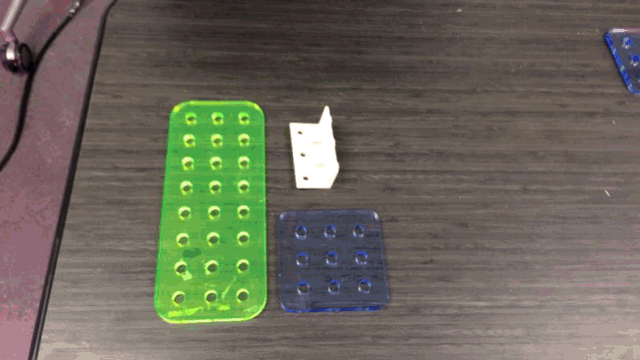
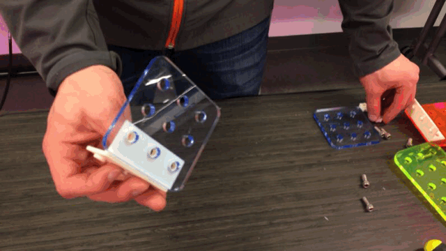
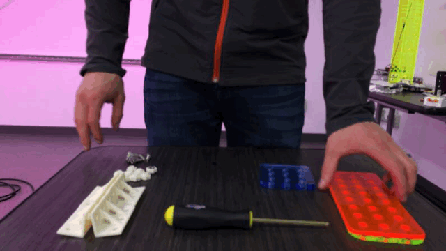
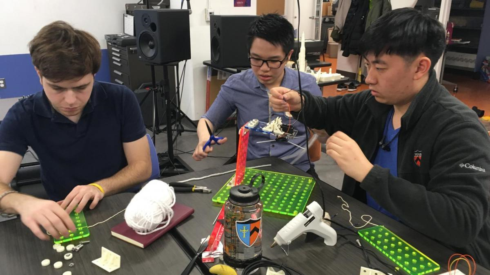

# BuildingBits
## Introduction
Welcome to Building Bits!  Building Bits is an open source modular building system, similar to Lego, that can be easily customized to meet specific needs.  It can be made from scratch using a laser cutter and 3D printer.  

There are two basic types of parts in the Building Bits system:
1. Brackets and Nuts: These parts are 3D printed, and form the connective joints between Plates.  All connections use 1/4-20 bolts.  
2. Plates: Plates are laser cut from 1/4 inch think acyrlic sheets, and are used to create floors, walls, and beams in your projects.  

This repository contains the source files for the Building Bits construction system.  The files for all 3D printed parts are given in Inventor part format (.ipt) as well as .stl.  The laser cut plates are given in .dwg.

## Parts List
- 3D printer
- Laser cutter
- 1/4 inch thick acyrlic sheet
- 1/4-20 nuts (7/16 inch edge-to-edge width recommended)
- 1/4-20 bolts (5/8 inch length recommended)
- Imagination

# Creation Instructions
## Brackets and Nuts
Brackets and Nuts should be 3D printed.  After printing, finish each nut by placing a metal nut in the void on the back, and press fit it in using pliers.

Brackets and Nuts can be customized as desired, but it is generally easier (and faster) to laser cut custom Plates.

## Plates
Plates are intended to be quickly and easily customized to fit your custom parts.  The fundamental Plate layout is depicted in BLANK, use the example plate files or start from scratch using the given dimensions.  As long as your Plates follow the conventions in BLANK, it fit well with your Brackets, Nuts, and other Plates.  Plates should be laser cut from 1/4 inch thick acyrlic.  

## Usage Instructions
Using Bulding Bits is simple.

To connect two plates, use an L-Bracket and fit it into the relevant holes.  

If you need more strength, place a BackNut on the backside of the hole, and thread a bolt in from the bracket side.

That's it!  Now you can easily build up your structures with the required structural integrity.  

# Building Bits in Action
## Radiolab
The folks at WYNC's RadioLab podcast used Building Bits to construct a "plant dropper" experimental device.  Check out the episode and see how Building Bits did at http://www.radiolab.org/story/smarty-plants/.  

## STC 209
Building Bits has been used by students in Princeton STC 209: Engineering and the Arts course.  Students used Building Bits to quickly create interactive art installations that used motors, servos, and lights.  

## Makerfaire 2017
Princeton Council on Science and Technology took Building Bits to the 2017 NYC Makerfaire!  Building Bits were used as (literal) education platforms where others could explore sererval different circuit building workshops.  Building Bits helped keep everything organized and secure.

## Princeton "Living at the Intersection" Showcase Presentation
Building Bits was featured during a showcase presentation at the 2018 Princeton "Living at the Intersection" Symposium.  The Building Bits omni-directional camera rig, seen below, was a big hit.  

